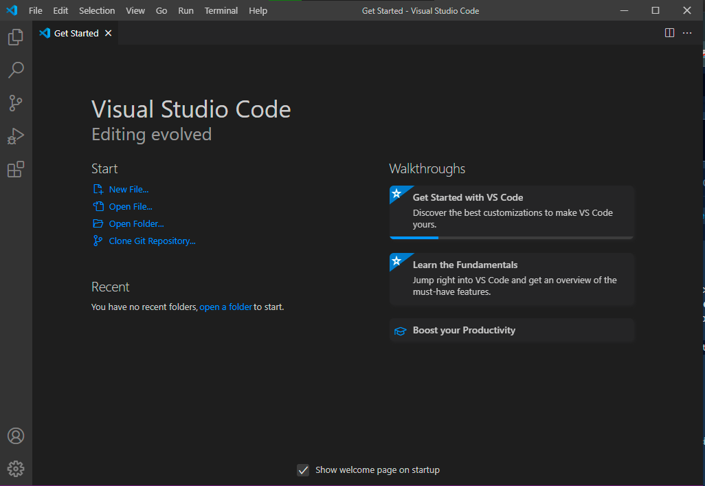
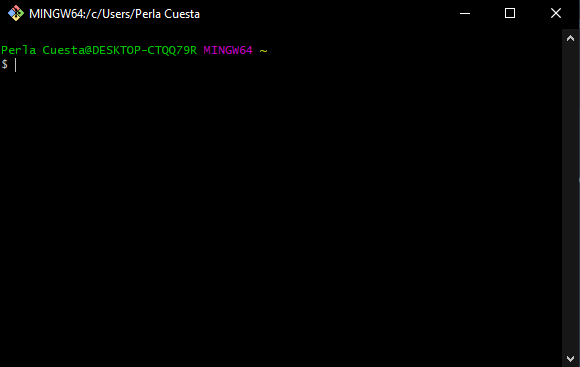
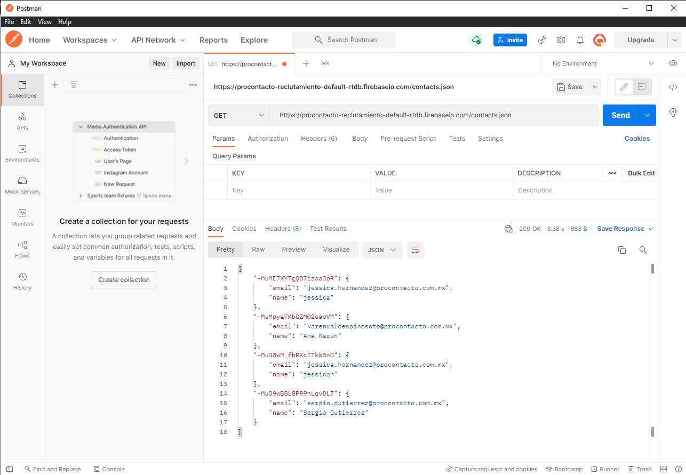
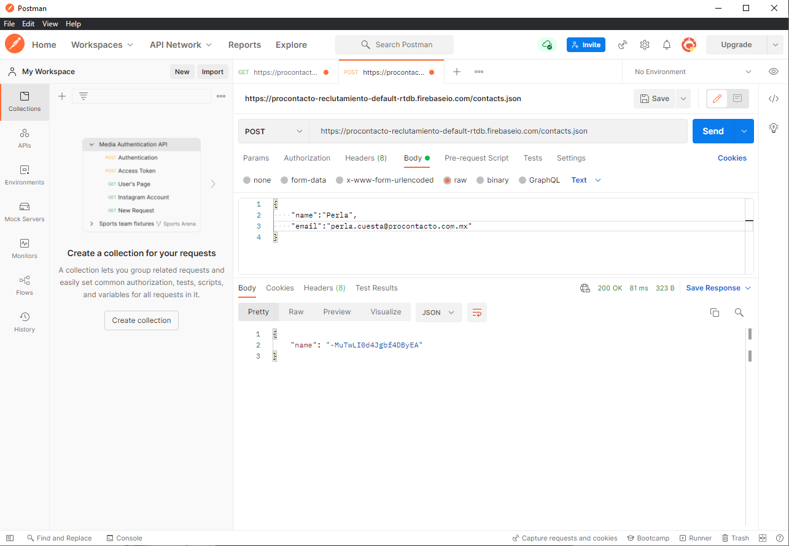
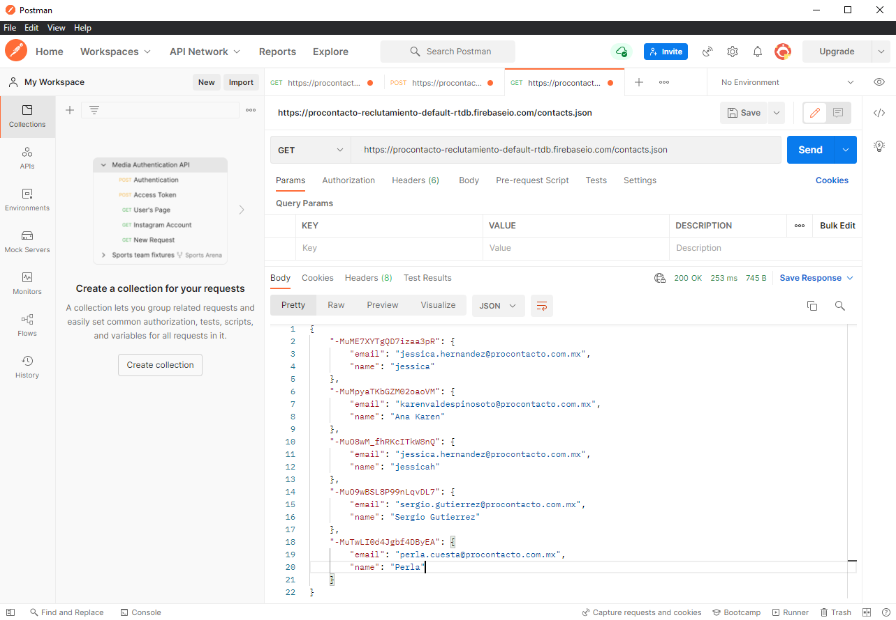

# Practica ProContacto

Evaluación práctica de ProContacto

## EJERCICIO 1

### _Instalación de ambiente_

 1. Instalación de IDE Visual Studio Code
> _Imagen que muestra el IDE Visual Studio Code instalado_
> 
> 
 2. Instalación de GIT y GIT Bash
> _Imagen que muestra Git instalado_
> 
> 
 

## EJERCICIO 2
  1. ¿Qué es un servidor HTTP? 
  >> _Es un software el cual nos permite conexiones bidireccionales o unidireccionales a varios servicios utilizando el protocolo de HTTP, accediendo a información que nos otorga el cliente._
  2. ¿Qué son los verbos HTTP? 
  >> _Son los metodos de peticiones mediante el protocolo HTTP._
  >> - **GET**: Se utiliza para traer datos.
  >> - **HEAD**: Es utilizado para traer datos como **GET** pero sin cuerpo.
  >> - **POST**:  Es utilizado para enviar datos y realizar en ocasiones un cambio en el servidor.
  >> - **PUT**:  Reemplazar los datos del recurso llamado.
  >> - **DELETE**: Borra el recurso llamado.
  3. ¿Qué es un request y un response en una comunicación HTTP? ¿Qué son los headers?
  >> - **Request**: Es la solicitud que se realiza al servidor con el mensaje de petición.
  >> - **Response**: Es la respuesta la cual nos contesta el servidor con los datos que fueron solicitados mediante la petición.
  >> - **Headers**: son encanbezados que los contienen tanto un `request` como un `response` y contienen datos como del cliente y del servidor.
  4. ¿Qué es un queryString? 
  >> _Son datos que se envian mediante el cuerpo de la petición para optimizar el uso de paginas dinámicas y evitar el envio de datos por la URL._
  5. ¿Qué es el responseCode? ¿Qué significado tiene los posibles valores devueltos?
  >> El `responseCode` nos indica si la solicitud HTTP se ha completado o se ha realizado, siendo cindo clases de respuestas:
  >> 1. Respuestas Informativas (100 - 199)
  >> 2. Respuestas Satisfactorias (200 - 299)
  >> 3. Redirecciones (300 - 399)
  >> 4. Errores de los clientes (400 - 499)
  >> 5. Errores de los servidores (500 - 599)
  6.	¿Cómo se envía la data en un GET y cómo en un POST? 
  >> Con el método `GET` los datos se envian de visible al cliente, es decir mediante la URL; mientras con el método `POST` los datos son enviados de manera oculta, es decir no son visibles para el cliente.
  7.	¿Qué verbo http utiliza el navegador cuando accedemos a una página?
  >> `CONNECT`: Ya que con este método iniciamos la comunicación con el recurso solicitado.
  8.	Explicar brevemente qué son las estructuras de datos JSON y XML dando ejemplo de estructuras posibles.
  >> - **JSON**: _Colección de datos agrupados mediante llaves, corchetes y paréntesis que delimitan los datos almacenados, teniendo en su interior pares de nombre y valor de variables._ 
  >> ```json
  >> {
  >>  "personas" : [
  >>    {
  >>      "nombre" : "Perla Lizbeth",
  >>      "apellidos" : "Cuesta Garcia",
  >>      "edad": 26,
  >>    },
  >>    {
  >>      "nombre" : "Eduardo Alejandro",
  >>      "apellidos" : "Gallardo Gómez",
  >>      "edad": 26,
  >>    }
  >>  ]
  >> }
  >> ```
  >> - **XML**: _Es una colección de datos agrupados mediante pares de etiquetas que determinan el inicio y el fin de cada dato, teniendo en su interior de cada par de etiquetas el valor del dato._
  >> ```xml
  >> <persona>
  >>    <nombre>Perla Lizbeth</nombre>
  >>    <apellidos>Cuesta García</apellidos>
  >>    <edad>26</edad>
  >> </persona>
  >> <persona>
  >>    <nombre>Eduardo Alejandro</nombre>
  >>    <apellidos>Gallardo Gómez</apellidos>
  >>    <edad>26</edad>
  >> </persona>
  >> ```
  9.	Explicar brevemente el estándar SOAP
  >> _Es un protocolo que permite la comuniciación entre diferentes aplicaciones sin importar el lenguaje o plataforma en la cual esten diseñados, utiliza cualquier protocolo de comunicación (HTTP, SMTP, TCP, etc.) siendo enviadas las peticiones mediante XML._
  10.	Explicar brevemente el estándar REST Full
  >> _Es un servicio utilizado para compartir informacion de manera bidireccional, es decir, Consulta-Respuesta, utilizando el protocolo de comunicación HTTP_
  11.	¿Qué son los headers en un request? ¿Para qué se utiliza el key Content-type en un header?
  >> _Los `headers` transmiten información referente al navegador del cliente, el recurso solicitado del servidor, lenguaje, cookies, entre otros datos._
  >> _El `key Content-type` indica al cliente el tipo de dato que será retornado._

## EJERCICIO 3

1. Request GET a la URL
> 
2. Request POST a la URL con body
> 
3. Request GET a la URL
> 

¿Qué diferencias se observan entre las llamadas del punto 1 y 3?
> _En el Get del punto 1, se realiza una petición de ver los datos al inicio del ejercicio aparecen unicamente 4 registros, en el punto 2 se realiza la inserción del registro a nombre de Perla, por ese motivo al momento de realizar la consulta nuevamente en el punto 3, podemos apreciar 5 registros ya que se ha insertado uno mas en el punto anterior a nombre de Perla_

## EJERCICIO 4

### _Trailhead_
- URL de resolución de resultados de los módulos de Trailhead, [aquí](https://github.com/PerlaCuesta/PracticaProContacto).

## EJERCICIO 5

### _Salesforce_

- **Lead** :
- **Account** :
- **Contact** :
- **Opportunity** :
- **Product** :
- **PriceBook** :
- **Quote** :
- **Asset** :
- **Case** :
- **Article** :

_Diagrama UML Salesforce_

## EJERCICIO 6
### _Soluciones Salesforce_

1.	¿Qué es Salesforce?
> _Es una plataforma de Gestión de Relaciones con el Cliente (CRM), la cual permite tener la información de cada cliente, dando inclusión a todas las áreas de cada empresa._
2.	¿Qué es Sales Cloud?
> _Es una plataforma de Ventas personalizada ha cada empresa, la cual te permite tener un mayor seguimiento de clientes y tener reportes en tiempo real._
3.	¿Qué es Service Cloud?
> _Es una plataforma de Servicio al cliente, es personalizable para cada empresa, con la cual puedes brindar una atención mas personalizada y ágil a cada uno de los clientes._
4.	¿Qué es Health Cloud?
> _Es un software para empresas de salud, que gestiona a los pacientes, ofreciendo monitoreo de pacientes y controles automatizados para control de emergencias._
5.	¿Qué es Marketing Cloud?
> _Es un software que apoya al marketing permitiendote conocer a los clientes, personalizar las interacciones con cada cliente, asi como adaptar campañas para mejores resultados._

### _Funcionalidades de Salesforce_

1.	¿Qué es un RecordType?
> _Son los tipos de registro en Salesforce los cuales permiten diferentes procesos comerciales, valores de lista de selección y diseños de página para diferentes usuarios según el tipo._
2.	¿Qué es un ReportType?
> _Son los tipos de informes de Salesforce, se podria comparar como una plantillaque contiene: Objeto, Relación de objetos, Campos incluidos en los resultados, Campos marcados de forma predeterminada y Nombres para mostrar de campo_
3.	¿Qué es un Page Layout?
> _Es el diseño de página o la maquetación de una página._
4.	¿Qué es un Compact Layout?
> _Personalización de diseños compactos donde determina los campos que desea visualizar._
5.	¿Qué es un Perfil?
> _Los perfiles definen como se acceden los usuarios a la aplicación permitiendo ver algunos objetos o datos, asignando un perfil para cada usuario._
6.	¿Qué es un Rol?
> _Con los roles se puede controlar el nivel de visibilidad que tiene cada usuario, sobre los datos._
7.	¿Qué es un Validation Rule?
> _Son las reglas de validación que contienen formulas o expresiones para evaluar los datos que se ingresan, devolviendo valores booleanos, marcando error en la regla si esta nos devuelve **False**._
8.	¿Qué diferencia hay entre una relación Master Detail y Lookup?
> _**Master Detail** es una relación padre-hijo en donde el objeto controla algunos comportamientos del objeto de detalle, en caso de eliminación, se eliminan sus registros de detalles relacionados; mientras que **Lookup** en este tipo de relación se vinculan dos objetos, pero no se eliminan._
9.	¿Qué es un Sandbox?
> _Es un proceso de seguridad que permite realizar pruebas de manera aislada, sin perjudicar al software._
10.	¿Qué es un ChangeSet?
> _Conjunto de cambios versionado donde se tienen los cambios nuevos como anteriores del software._
11.	¿Para qué sirve el import Wizard de Salesforce?
> _El asistente de importación de datos permite la importación fácil de datos para muchos objetos estándar de Salesforce, incluyendo cuentas, contactos, clientes, soluciones, etc. Se pueden importar hasta 50,000 registros a la vez._
12.	¿Para qué sirve la funcionalidad Web to Lead?
> _Permite diseñar un formulario incluyendo las preguntas más adecuadas para cada tipo de negocio con el objetivo de insertarlo en un blog, automatizando así la captación de leads y la integración de los datos de los usuarios en el CRM._
13.	¿Para qué sirve la funcionalidad Web to Case?
> _Permite recopilar consultas de soporte y convertirlas en casos, ayudando a responder a los clientes más rápido, mejorando la productividad del equipo de soporte._
14.	¿Para qué sirve la funcionalidad Omnichannel?
> _Estrategia de mercado para ofrecer diferentes canales de comunucación para ofrecer la misma experiencias sin importar el canal utilizado._
15.	¿Para qué sirve la funcionalidad Chatter?
> _Conectar a los empleados con los archivos, datos y expertos para ofrecer mejor calidad en el servicio._

### _Conceptos generales_

1.	¿Qué significa SaaS?
>
2.	¿Salesforce es Saas?
>
3.	¿Qué significa que una solución sea Cloud?
>
4.	¿Qué significa que una solución sea On-Premise?
>
5.	¿Qué es un pipeline de ventas?
>
6.	¿Qué es un funnel de ventas?
>
7.	¿Qué significa Customer Experience?
>
8.	¿Qué significa omnicanalidad?
>
9.	¿Qué significa que un negocio sea B2B?¿Qué significa que un negocio sea B2C?¿Qué es un KPI?
>
10.	¿Qué es una API y en qué se diferencia de una Rest API?
>
11.	¿Qué es un Proceso Batch?
>
12.	¿Qué es Kanban?
>
13.	¿Qué es un ERP? 
>
14.	¿Salesforce es un ERP?
>

## EJERCICIO 7
_Dataloader_
